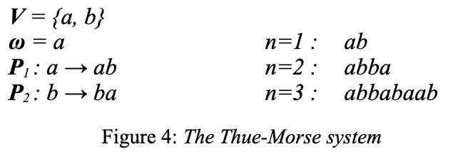

# Procedural City Generation

Procedural content generation, as opposed to static content generation, relies upon a sequence of generation instructions rather than a static block of data.

The following is based on ['A survey of procedural techniques for city generation', Kelly, McGabe](https://www.citygen.net/files/Procedural_City_Generation_Survey.pdf)

## Fractals

Fractals are systems that recursively repeat the same pattern. A clear example is the mandlebrot set.

## L-systems

L-systems seem to be all we need to model cities. This is a complex as we go. An easier approach would be grid layouts and some randomness in the building positions and shapes.

Lindenmayer systems rely on rewriting. Rewriting is a technique for modelling complex objects by successively replacing parts of a simple inital object using a set of rewriting rules or productions. The components are as follows:

- V (the alphabet) is a set of symbols defining what can be replaced (variables)
- S is a set of symbols containing elements that remain fixed
- $\omega$ (axiom or initiator) is a string of symbols and constants that define the initial state of the system
- P is the set of rules or productions defining the way variables can be replaced with combinations of constants or other variables. A production consists of two strings, the predecessor and successor.

An example:

## Split grammars

Will talk about this later - this is for realistic building generation that we may not need.

---

## Procedural city generation

### Road network: grid layout

Our approach to generating a procedural city focuses on creating a grid-based system inspired by American cities like New York. This approach offers a good balance between visual realism and implementation complexity, making it achievable within our project constraints.

#### Grid System

The city is conceptually built on an infinite 2D grid where each cell represents either a road or a potential building location. We don't actually store this grid in memory - instead, we use mathematical formulas to determine what should exist at any given coordinate. This makes our city theoretically infinite while only requiring memory for what's currently visible.

#### Road Network

Roads are placed at regular intervals throughout the grid, creating city blocks similar to Manhattan's layout. The spacing between roads determines the size of our city blocks. We use modulo arithmetic to determine if any given grid coordinate should be a road, eliminating the need to store an actual road network.

#### Building Generation

For grid cells that aren't roads, we generate buildings using a deterministic approach (or pseudorandom approach - TBD):

The building's characteristics (height, width, style) are determined by feeding the grid coordinates into a pseudo-random number generator. This ensures that the same building always appears at the same coordinates
Building parameters can be varied within realistic constraints to create visual diversity

#### View Frustum Culling

Since we can't generate an infinite city at once, we only generate what the player can actually see:

- Calculate which grid cells fall within the camera's view frustum
- Check if each cell is within the maximum view distance
- Verify if the cell falls within the field of view angle
- Only generate and render buildings that pass these tests
